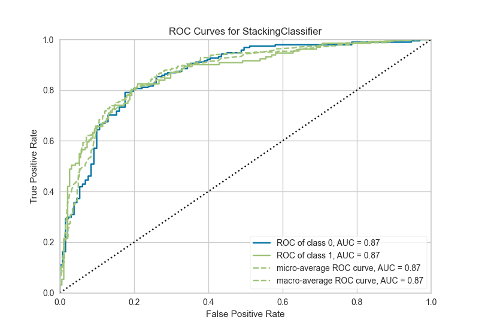

```{r setup, include=FALSE}
knitr::opts_chunk$set(echo = TRUE)
```

## Create Python Environments


```{r python_env}
library(reticulate)

use_python("/usr/bin/python3")
```

## Prepare the data


```{r pre_data}
# import pycaret.datasets.*
pcaret_data <- import("pycaret.datasets", as = "pd", convert = FALSE)

juice <- pcaret_data$get_data("juice")
juice <- reticulate::py_to_r(juice)
```


## Setup model

```{r import_pycaret}
# import pycaret.classification.*
pcaret_model <- import("pycaret.classification", as = "pcaret", convert = FALSE)

# intialize the setup (in Non-Notebook env)
exp_clf = pcaret_model$setup(juice, target = 'Purchase', html = FALSE, silent = TRUE)
```

```{r, eval=FALSE}
Setup Succesfully Completed!
                               Description             Value
0                               session_id              4282
1                                   Target          Purchase
2                              Target Type            Binary
3                            Label Encoded      CH: 0, MM: 1
4                            Original Data        (1070, 19)
5                           Missing Values             False
6                         Numeric Features                15
7                     Categorical Features                 3
8                         Ordinal Features             False
9                High Cardinality Features             False
10                 High Cardinality Method              None
11                   Transformed Train Set         (748, 15)
12                    Transformed Test Set         (322, 15)
13                      Shuffle Train-Test              True
14                     Stratify Train-Test             False
15                          Fold Generator   StratifiedKFold
16                             Fold Number                10
17                                CPU Jobs                -1
18                                 Use GPU             False
19                          Log Experiment             False
20                         Experiment Name  clf-default-name
21                                     USI              f720
22                         Imputation Type            simple
23          Iterative Imputation Iteration              None
24                         Numeric Imputer              mean
25      Iterative Imputation Numeric Model              None
26                     Categorical Imputer          constant
27  Iterative Imputation Categorical Model              None
28           Unknown Categoricals Handling    least_frequent
29                               Normalize             False
30                        Normalize Method              None
31                          Transformation             False
32                   Transformation Method              None
33                                     PCA             False
34                              PCA Method              None
35                          PCA Components              None
36                     Ignore Low Variance             False
37                     Combine Rare Levels             False
38                    Rare Level Threshold              None
39                         Numeric Binning             False
40                         Remove Outliers             False
41                      Outliers Threshold              None
42                Remove Multicollinearity             False
43             Multicollinearity Threshold              None
44                              Clustering             False
45                    Clustering Iteration              None
46                     Polynomial Features             False
47                       Polynomial Degree              None
48                    Trignometry Features             False
49                    Polynomial Threshold              None
50                          Group Features             False
51                       Feature Selection             False
52            Features Selection Threshold              None
53                     Feature Interaction             False
54                           Feature Ratio             False
55                   Interaction Threshold              None
56                           Fix Imbalance             False
57                    Fix Imbalance Method             SMOTE
```

## Get best model

```{r best_model}
best <- pcaret_model$compare_models()
```

```{r, eval=FALSE}
                                    Model  Accuracy     AUC  Recall   Prec.  \
lr                    Logistic Regression    0.8316  0.9008  0.7602  0.8070   
ridge                    Ridge Classifier    0.8276  0.0000  0.7771  0.7887   
lda          Linear Discriminant Analysis    0.8276  0.9027  0.7771  0.7887   
gbc          Gradient Boosting Classifier    0.8035  0.8882  0.7433  0.7601   
catboost              CatBoost Classifier    0.8021  0.8933  0.7302  0.7654   
ada                  Ada Boost Classifier    0.8009  0.8721  0.7063  0.7800   
lightgbm  Light Gradient Boosting Machine    0.7995  0.8751  0.7534  0.7464   
rf               Random Forest Classifier    0.7914  0.8721  0.7298  0.7463   
xgboost         Extreme Gradient Boosting    0.7901  0.8743  0.7401  0.7369   
et                 Extra Trees Classifier    0.7820  0.8297  0.7266  0.7331   
dt               Decision Tree Classifier    0.7648  0.7525  0.6962  0.7117   
nb                            Naive Bayes    0.7621  0.8375  0.7338  0.6946   
knn                K Neighbors Classifier    0.7366  0.7596  0.6523  0.6776   
svm                   SVM - Linear Kernel    0.5923  0.0000  0.1367  0.0912   
qda       Quadratic Discriminant Analysis    0.5267  0.5264  0.4586  0.2977 

              F1   Kappa     MCC  TT (Sec)  
lr        0.7810  0.6446  0.6473     0.035  
ridge     0.7811  0.6391  0.6410     0.006  
lda       0.7811  0.6391  0.6410     0.005  
gbc       0.7491  0.5880  0.5908     0.021  
catboost  0.7445  0.5837  0.5871     0.865  
ada       0.7359  0.5775  0.5846     0.025  
lightgbm  0.7479  0.5818  0.5840     0.012  
rf        0.7350  0.5635  0.5667     0.059  
xgboost   0.7361  0.5623  0.5649     0.046  
et        0.7270  0.5461  0.5490     0.051  
dt        0.7005  0.5075  0.5111     0.008  
nb        0.7086  0.5090  0.5147     0.015  
knn       0.6613  0.4466  0.4501     0.012  
svm       0.1092  0.0241  0.0251     0.006  
qda       0.3271  0.0277  0.0565     0.005 
```


## Create stack model

### Create individual models

```{r individual_1}
# create individual models for stacking - Logistic Regression
lr <- pcaret_model$create_model('lr')
```

```{r, eval=FALSE}
      Accuracy     AUC  Recall   Prec.      F1   Kappa     MCC
0       0.8533  0.9430  0.7586  0.8462  0.8000  0.6848  0.6873
1       0.8133  0.8748  0.7586  0.7586  0.7586  0.6064  0.6064
2       0.8400  0.8896  0.7667  0.8214  0.7931  0.6629  0.6640
3       0.8133  0.8948  0.8333  0.7353  0.7812  0.6196  0.6233
4       0.7867  0.8596  0.7000  0.7500  0.7241  0.5506  0.5514
5       0.8400  0.8815  0.8000  0.8000  0.8000  0.6667  0.6667
6       0.8400  0.9289  0.7667  0.8214  0.7931  0.6629  0.6640
7       0.8267  0.9081  0.6667  0.8696  0.7547  0.6243  0.6375
8       0.8378  0.9257  0.7241  0.8400  0.7778  0.6512  0.6557
9       0.8649  0.9019  0.8276  0.8276  0.8276  0.7165  0.7165
Mean    0.8316  0.9008  0.7602  0.8070  0.7810  0.6446  0.6473
SD      0.0213  0.0248  0.0502  0.0426  0.0276  0.0440  0.0435
```


```{r individual_2}
# create individual models for stacking - Ridge Classifier
ridge <- pcaret_model$create_model('ridge')
```

```{r, eval=FALSE}
      Accuracy  AUC  Recall   Prec.      F1   Kappa     MCC
0       0.8533  0.0  0.8276  0.8000  0.8136  0.6927  0.6930
1       0.7733  0.0  0.7241  0.7000  0.7119  0.5251  0.5253
2       0.8400  0.0  0.7667  0.8214  0.7931  0.6629  0.6640
3       0.8133  0.0  0.8333  0.7353  0.7812  0.6196  0.6233
4       0.7867  0.0  0.7333  0.7333  0.7333  0.5556  0.5556
5       0.8267  0.0  0.8000  0.7742  0.7869  0.6409  0.6411
6       0.8533  0.0  0.8000  0.8276  0.8136  0.6927  0.6930
7       0.8400  0.0  0.7000  0.8750  0.7778  0.6552  0.6651
8       0.8514  0.0  0.7586  0.8462  0.8000  0.6823  0.6849
9       0.8378  0.0  0.8276  0.7742  0.8000  0.6639  0.6649
Mean    0.8276  0.0  0.7771  0.7887  0.7811  0.6391  0.6410
SD      0.0267  0.0  0.0452  0.0526  0.0318  0.0542  0.0548
```


```{r individual_3}
# create individual models for stacking - Linear Discriminant Analysis
lda <- pcaret_model$create_model('lda')
```

```{r, eval=FALSE}
      Accuracy     AUC  Recall   Prec.      F1   Kappa     MCC
0       0.8533  0.9445  0.8276  0.8000  0.8136  0.6927  0.6930
1       0.7733  0.8726  0.7241  0.7000  0.7119  0.5251  0.5253
2       0.8400  0.8919  0.7667  0.8214  0.7931  0.6629  0.6640
3       0.8133  0.8919  0.8333  0.7353  0.7812  0.6196  0.6233
4       0.7867  0.8596  0.7333  0.7333  0.7333  0.5556  0.5556
5       0.8267  0.8904  0.8000  0.7742  0.7869  0.6409  0.6411
6       0.8533  0.9341  0.8000  0.8276  0.8136  0.6927  0.6930
7       0.8400  0.9119  0.7000  0.8750  0.7778  0.6552  0.6651
8       0.8514  0.9241  0.7586  0.8462  0.8000  0.6823  0.6849
9       0.8378  0.9065  0.8276  0.7742  0.8000  0.6639  0.6649
Mean    0.8276  0.9027  0.7771  0.7887  0.7811  0.6391  0.6410
SD      0.0267  0.0254  0.0452  0.0526  0.0318  0.0542  0.0548
```


```{r individual_4}
# create individual models for stacking - Gradient Boosting Classifier
gbc <- pcaret_model$create_model('gbc')
```

```{r, eval=FALSE}
      Accuracy     AUC  Recall   Prec.      F1   Kappa     MCC
0       0.8400  0.9318  0.7586  0.8148  0.7857  0.6583  0.6594
1       0.7733  0.8692  0.7931  0.6765  0.7302  0.5369  0.5419
2       0.7333  0.8570  0.6000  0.6923  0.6429  0.4318  0.4346
3       0.8133  0.8711  0.8667  0.7222  0.7879  0.6237  0.6319
4       0.7733  0.8604  0.7333  0.7097  0.7213  0.5304  0.5306
5       0.8400  0.8911  0.7667  0.8214  0.7931  0.6629  0.6640
6       0.8400  0.9252  0.7667  0.8214  0.7931  0.6629  0.6640
7       0.8267  0.9015  0.7000  0.8400  0.7636  0.6286  0.6351
8       0.7973  0.8989  0.6897  0.7692  0.7273  0.5667  0.5689
9       0.7973  0.8759  0.7586  0.7333  0.7458  0.5773  0.5775
Mean    0.8035  0.8882  0.7433  0.7601  0.7491  0.5880  0.5908
SD      0.0338  0.0247  0.0668  0.0577  0.0445  0.0707  0.0708
```


```{r individual_5}
# create individual models for stacking - CatBoost Classifier
catboost <- pcaret_model$create_model('catboost')
```

```{r, eval=FALSE}
      Accuracy     AUC  Recall   Prec.      F1   Kappa     MCC
0       0.8667  0.9460  0.7931  0.8519  0.8214  0.7153  0.7164
1       0.7733  0.8636  0.7931  0.6765  0.7302  0.5369  0.5419
2       0.7467  0.8696  0.6667  0.6897  0.6780  0.4693  0.4695
3       0.8267  0.8852  0.8667  0.7429  0.8000  0.6486  0.6547
4       0.7600  0.8648  0.6333  0.7308  0.6786  0.4886  0.4918
5       0.8000  0.8763  0.7000  0.7778  0.7368  0.5763  0.5784
6       0.8267  0.9289  0.7000  0.8400  0.7636  0.6286  0.6351
7       0.8133  0.9200  0.6667  0.8333  0.7407  0.5977  0.6068
8       0.8108  0.8920  0.7241  0.7778  0.7500  0.5981  0.5991
9       0.7973  0.8866  0.7586  0.7333  0.7458  0.5773  0.5775
Mean    0.8021  0.8933  0.7302  0.7654  0.7445  0.5837  0.5871
SD      0.0336  0.0272  0.0683  0.0586  0.0430  0.0695  0.0702
```


### Create individual models

```{r stacking}
# stacking models
stacker <- pcaret_model$stack_models(estimator_list = list(lr, ridge, lda, gbc, catboost))
```

```{r, eval=FALSE}
      Accuracy     AUC  Recall   Prec.      F1   Kappa     MCC
0       0.8533  0.9438  0.7586  0.8462  0.8000  0.6848  0.6873
1       0.7733  0.8748  0.7586  0.6875  0.7213  0.5311  0.5329
2       0.8133  0.8933  0.7333  0.7857  0.7586  0.6067  0.6077
3       0.8400  0.8963  0.9000  0.7500  0.8182  0.6774  0.6864
4       0.7867  0.8530  0.7000  0.7500  0.7241  0.5506  0.5514
5       0.8267  0.8919  0.8000  0.7742  0.7869  0.6409  0.6411
6       0.8533  0.9319  0.8000  0.8276  0.8136  0.6927  0.6930
7       0.8267  0.9119  0.6667  0.8696  0.7547  0.6243  0.6375
8       0.8243  0.9211  0.7241  0.8077  0.7636  0.6245  0.6269
9       0.8649  0.9073  0.8276  0.8276  0.8276  0.7165  0.7165
Mean    0.8263  0.9025  0.7669  0.7926  0.7769  0.6349  0.6381
SD      0.0277  0.0255  0.0642  0.0515  0.0362  0.0576  0.0579
```


## Plot ROC

```{r ROC}
pcaret_model$plot_model(stacker, save = TRUE)
```


```{r, echo=FALSE}

```

